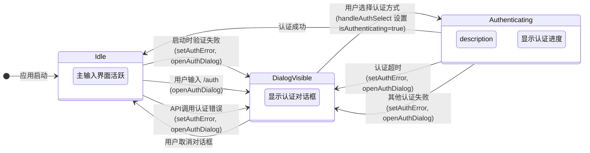
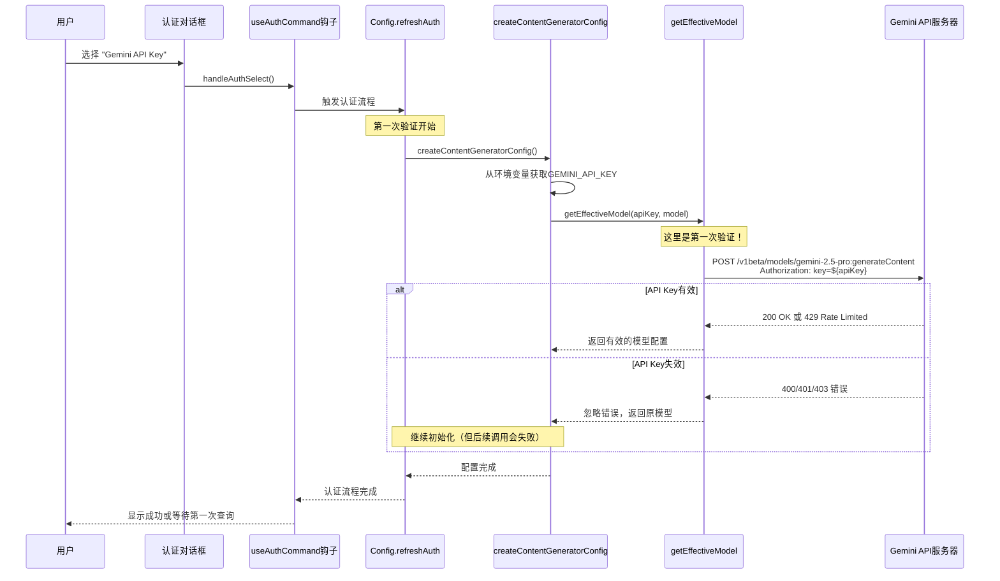
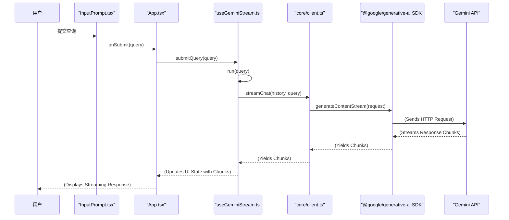

# Gemini CLI 认证流程深度分析

## 概述

本文档深入分析了 Gemini CLI 的认证系统，重点追踪 `authError`、`isAuthenticating`、`isAuthDialogOpen` 三个关键状态的变化时机，以及 API Key 失效时程序的第一次验证位置。

## 核心认证状态分析

### 1. authError: string | null

**作用**：存储和显示认证相关的错误信息

**初始化**：

```typescript
// packages/cli/src/ui/App.tsx:134
const [authError, setAuthError] = useState<string | null>(null);
```

**状态变更时机**：

1. **应用启动时校验失败**

   ```typescript
   // packages/cli/src/ui/App.tsx:195-200
   useEffect(() => {
     if (settings.merged.selectedAuthType) {
       const error = validateAuthMethod(settings.merged.selectedAuthType);
       if (error) {
         setAuthError(error);
         openAuthDialog();
       }
     }
   }, [settings.merged.selectedAuthType, openAuthDialog, setAuthError]);
   ```

2. **认证超时**

   ```typescript
   // packages/cli/src/ui/App.tsx:684-689
   <AuthInProgress
     onTimeout={() => {
       setAuthError('Authentication timed out. Please try again.');
       cancelAuthentication();
       openAuthDialog();
     }}
   />
   ```

3. **API 调用需要重新认证**

   ```typescript
   // packages/cli/src/ui/App.tsx:508
   const onAuthError = useCallback(() => {
     setAuthError('reauth required');
     openAuthDialog();
   }, [openAuthDialog, setAuthError]);
   ```

4. **useAuthCommand 内部调用**
   ```typescript
   // packages/cli/src/ui/hooks/useAuthCommand.ts:51-55
   } catch (e) {
     setAuthError(`Failed to login. Message: ${getErrorMessage(e)}`);
     openAuthDialog();
   } finally {
     setIsAuthenticating(false);
   }
   ```

### 2. isAuthDialogOpen: boolean

**作用**：控制认证方式选择对话框的显示和隐藏

**状态变更为 true 的时机**：

1. **首次启动或未配置认证**

   ```typescript
   // packages/cli/src/ui/hooks/useAuthCommand.ts:22-24
   const [isAuthDialogOpen, setIsAuthDialogOpen] = useState(
     settings.merged.selectedAuthType === undefined,
   );
   ```

2. **显式调用 openAuthDialog()**

   ```typescript
   // packages/cli/src/ui/hooks/useAuthCommand.ts:26-28
   const openAuthDialog = useCallback(() => {
     setIsAuthDialogOpen(true);
   }, []);
   ```

   调用场景：

   - 用户输入 `/auth` 命令
   - 启动时发现已配置的认证方式无效
   - API 请求因为认证失败
   - 交互式认证过程超时
   - useAuthCommand 内部认证流程失败

### 3. isAuthenticating: boolean

**作用**：指示程序是否正在进行认证过程

**状态变更为 true 的关键位置**：

```typescript
// packages/cli/src/ui/hooks/useAuthCommand.ts:41
setIsAuthenticating(true);
```

**触发条件**：

```typescript
// packages/cli/src/ui/hooks/useAuthCommand.ts:34-50
useEffect(() => {
  const authFlow = async () => {
    // 当对话框关闭，并且认证方式已选择时
    if (isAuthDialogOpen || !settings.merged.selectedAuthType) {
      return;
    }

    try {
      setIsAuthenticating(true); // <-- 在这里变为 true
      await performAuthFlow(
        settings.merged.selectedAuthType as AuthType,
        config,
      );
    } catch (e) {
      setAuthError(`Failed to login. Message: ${getErrorMessage(e)}`);
      openAuthDialog();
    } finally {
      setIsAuthenticating(false); // <-- 在这里变为 false
    }
  };

  void authFlow();
}, [isAuthDialogOpen, settings, config, setAuthError, openAuthDialog]);
```

## 认证流程状态机



## API Key 验证流程深度分析

### 第一次验证位置

**关键发现**：程序在 `packages/core/src/core/modelCheck.ts` 的 `getEffectiveModel` 函数中进行第一次 API Key 验证。

```typescript
// packages/core/src/core/modelCheck.ts:29-68
export async function getEffectiveModel(
  apiKey: string,
  currentConfiguredModel: string,
): Promise<string> {
  // ...
  const endpoint = `https://generativelanguage.googleapis.com/v1beta/models/${modelToTest}:generateContent?key=${apiKey}`;
  const body = JSON.stringify({
    contents: [{ parts: [{ text: 'test' }] }],
    generationConfig: {
      maxOutputTokens: 1,
      temperature: 0,
      topK: 1,
      thinkingConfig: { thinkingBudget: 0, includeThoughts: false },
    },
  });

  const controller = new AbortController();
  const timeoutId = setTimeout(() => controller.abort(), 2000);

  try {
    const response = await fetch(endpoint, {
      method: 'POST',
      headers: { 'Content-Type': 'application/json' },
      body,
      signal: controller.signal,
    });

    clearTimeout(timeoutId);

    if (response.status === 429) {
      // 处理速率限制，切换到 Flash 模型
      return fallbackModel;
    }
    return currentConfiguredModel;
  } catch (_error) {
    clearTimeout(timeoutId);
    // 关键：忽略所有错误，包括 401/403 认证失败
    return currentConfiguredModel;
  }
}
```

### 验证时机链路



### 关键特点

1. **静默验证**：`getEffectiveModel` 被设计为静默函数，主要目的是检查模型可用性
2. **错误忽略**：故意忽略所有错误（包括无效 API Key 的 401/403 错误）
3. **真实验证延迟**：真正的 API Key 验证发生在用户第一次实际查询时

### 实际错误发现位置

失效的 API Key 真正被发现是在：

```typescript
// packages/cli/src/ui/hooks/useGeminiStream.ts:540-551
try {
  const stream = geminiClient.sendMessageStream(queryToSend, abortSignal);
  // ...
} catch (error: unknown) {
  if (error instanceof UnauthorizedError) {
    onAuthError(); // <-- 在这里触发重新认证
  } else if (!isNodeError(error) || error.name !== 'AbortError') {
    addItem(
      {
        type: MessageType.ERROR,
        text: parseAndFormatApiError(
          getErrorMessage(error) || 'Unknown error',
          config.getContentGeneratorConfig().authType,
        ),
      },
      userMessageTimestamp,
    );
  }
}
```

## 查询提交到模型调用的完整链路

### 用户查询流程



### 关键调用点

1. **UI 层提交**：`App.tsx` → `handleFinalSubmit` → `submitQuery`
2. **Hook 处理**：`useGeminiStream.ts` → `run` → `geminiClient.streamChat`
3. **客户端调用**：`client.ts` → `sendMessageStream` → 使用 `@google/generative-ai` SDK
4. **实际 API 调用**：SDK 向 Gemini API 发起 HTTP 请求

## 不同认证方式的验证策略

### Google 登录 (LOGIN_WITH_GOOGLE_PERSONAL)

- **OAuth 流程**：浏览器认证 + 本地服务器回调
- **缓存机制**：`~/.gemini/oauth_creds.json`
- **Token 验证**：`client.getTokenInfo(token)`

### Gemini API Key (USE_GEMINI)

- **环境变量**：从 `GEMINI_API_KEY` 获取
- **第一次测试**：`getEffectiveModel` 函数（但忽略认证错误）
- **真实验证**：首次查询时的实际 API 调用

### Vertex AI (USE_VERTEX_AI)

- **环境变量**：需要 `GOOGLE_API_KEY`、`GOOGLE_CLOUD_PROJECT`、`GOOGLE_CLOUD_LOCATION`
- **验证策略**：同 Gemini API Key

## 总结

1. **状态管理**：三个核心状态通过 `useAuthCommand` 钩子统一管理
2. **验证时机**：API Key 的第一次验证发生在认证配置阶段，但故意忽略错误
3. **真实发现**：失效 API Key 真正被发现是在用户首次查询时
4. **错误处理**：多层级错误处理机制，包括自动重试和用户友好的错误提示

这种设计允许程序快速启动，将真正的网络验证延迟到实际需要时，提供了更好的用户体验。
