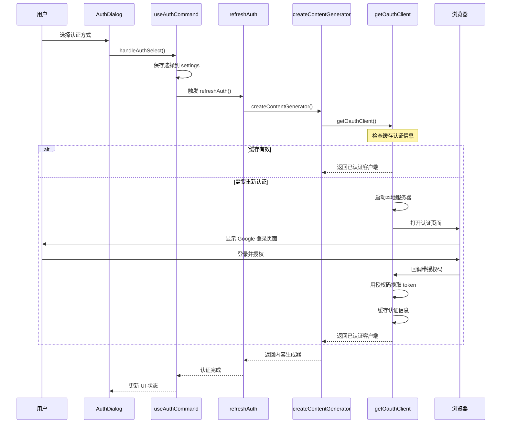

# Gemini CLI 认证系统深度分析

## 概述

Gemini CLI 的认证系统采用**多方式认证**策略，支持三种认证方法：

- **Google 登录** (`LOGIN_WITH_GOOGLE_PERSONAL`)
- **Gemini API Key** (`USE_GEMINI`)
- **Vertex AI** (`USE_VERTEX_AI`)

系统通过分层设计将认证逻辑与 UI 逻辑完全解耦，实现了灵活的认证流程控制。

## 核心架构设计

### 1. 双层组件结构

```typescript
export const AppWrapper = (props: AppProps) => (
  <SessionStatsProvider>
    <App {...props} />
  </SessionStatsProvider>
);
```

- **外层 AppWrapper**: 提供会话统计上下文
- **内层 App**: 核心业务逻辑组件

### 2. 核心组件关系图

```
App.tsx
│
├── useAuthCommand() ──→ 管理认证状态和流程
│   ├── isAuthDialogOpen
│   ├── handleAuthSelect ──→ 处理用户选择
│   ├── isAuthenticating
│   └── openAuthDialog
│
└── AuthDialog ──→ 认证选择界面
    ├── RadioButtonSelect ──→ 选项列表
    ├── validateAuthMethod ──→ 验证选择
    └── onSelect(handleAuthSelect) ──→ 回调处理
```

## 认证状态管理

### 核心认证状态

```typescript
// App.tsx 中的认证相关状态
const [authError, setAuthError] = useState<string | null>(null);

// useAuthCommand Hook 管理的状态
const {
  isAuthDialogOpen, // 认证对话框是否打开
  openAuthDialog, // 打开认证对话框
  handleAuthSelect, // 处理认证方式选择
  handleAuthHighlight, // 处理认证选项高亮
  isAuthenticating, // 是否正在认证中
  cancelAuthentication, // 取消认证过程
} = useAuthCommand(settings, setAuthError, config);
```

### 自动认证验证机制

```typescript
// App.tsx - 监听认证方式变化，自动验证
useEffect(() => {
  if (settings.merged.selectedAuthType) {
    const error = validateAuthMethod(settings.merged.selectedAuthType);
    if (error) {
      setAuthError(error);
      openAuthDialog(); // 验证失败自动打开对话框
    }
  }
}, [settings.merged.selectedAuthType, openAuthDialog, setAuthError]);
```

## 认证流程详细分析

### Step 1: 认证方法选择 (AuthDialog)

```typescript
// AuthDialog.tsx - 认证选项定义
const items = [
  { label: 'Login with Google', value: AuthType.LOGIN_WITH_GOOGLE_PERSONAL },
  { label: 'Gemini API Key', value: AuthType.USE_GEMINI },
  { label: 'Vertex AI', value: AuthType.USE_VERTEX_AI },
];

// 用户选择处理
const handleAuthSelect = (authMethod: string) => {
  const error = validateAuthMethod(authMethod);
  if (error) {
    setErrorMessage(error); // 显示验证错误
  } else {
    setErrorMessage(null);
    onSelect(authMethod, SettingScope.User); // 调用父组件回调
  }
};
```

**流程说明**：

- 用户通过键盘上下键选择认证方式
- 按 Enter 键触发 `handleAuthSelect`
- 先验证选择的认证方法是否可用
- 验证通过后调用父组件的 `onSelect` 回调

### Step 2: 认证选择处理 (useAuthCommand)

```typescript
// useAuthCommand.ts - handleAuthSelect 实现
const handleAuthSelect = useCallback(
  async (authMethod: string | undefined, scope: SettingScope) => {
    if (authMethod) {
      await clearCachedCredentialFile(); // 清除旧的认证缓存
      settings.setValue(scope, 'selectedAuthType', authMethod); // 保存选择
    }
    setIsAuthDialogOpen(false); // 关闭对话框
    setAuthError(null); // 清除错误状态
  },
  [settings, setAuthError],
);
```

**关键操作**：

1. **清除缓存**: `clearCachedCredentialFile()` - 删除旧的认证信息
2. **保存选择**: `settings.setValue()` - 将认证方式持久化到配置
3. **状态更新**: 关闭对话框，清除错误

### Step 3: 自动认证流程触发

```typescript
// useAuthCommand.ts - 监听认证方式变化
useEffect(() => {
  const authFlow = async () => {
    if (isAuthDialogOpen || !settings.merged.selectedAuthType) {
      return; // 对话框打开或未选择时不执行
    }

    try {
      setIsAuthenticating(true);
      await performAuthFlow(
        settings.merged.selectedAuthType as AuthType,
        config,
      );
    } catch (e) {
      setAuthError(`Failed to login. Message: ${getErrorMessage(e)}`);
      openAuthDialog(); // 认证失败重新打开对话框
    } finally {
      setIsAuthenticating(false);
    }
  };

  void authFlow();
}, [isAuthDialogOpen, settings, config, setAuthError, openAuthDialog]);
```

**触发条件**：

- 对话框关闭 (`!isAuthDialogOpen`)
- 已选择认证方式 (`settings.merged.selectedAuthType`)

## 认证系统的分层设计

### 1. **配置层** (`refreshAuth`)

```typescript
// packages/core/src/config/config.ts
async refreshAuth(authMethod: AuthType) {
  // 重置之前的配置
  this.contentGeneratorConfig = undefined!;

  // 创建新的配置
  const contentConfig = await createContentGeneratorConfig(
    modelToUse, authMethod, this
  );

  // 重新初始化客户端
  const gc = new GeminiClient(this);
  this.geminiClient = gc;
  this.toolRegistry = await createToolRegistry(this);
  await gc.initialize(contentConfig);
  this.contentGeneratorConfig = contentConfig;
}
```

**职责**: 重新配置和初始化，不处理具体认证

### 2. **配置创建层** (`createContentGeneratorConfig`)

```typescript
// packages/core/src/core/contentGenerator.ts
export async function createContentGeneratorConfig(
  model: string | undefined,
  authType: AuthType | undefined,
  config?: { getModel?: () => string },
): Promise<ContentGeneratorConfig> {
  // Google 登录：什么都不做，只返回配置
  if (authType === AuthType.LOGIN_WITH_GOOGLE_PERSONAL) {
    return contentGeneratorConfig;
  }

  // Gemini API Key：从环境变量获取
  if (authType === AuthType.USE_GEMINI && geminiApiKey) {
    contentGeneratorConfig.apiKey = geminiApiKey;
    return contentGeneratorConfig;
  }

  // Vertex AI：从环境变量获取
  if (
    authType === AuthType.USE_VERTEX_AI &&
    googleApiKey &&
    googleCloudProject
  ) {
    contentGeneratorConfig.apiKey = googleApiKey;
    contentGeneratorConfig.vertexai = true;
    return contentGeneratorConfig;
  }
}
```

**职责**: 根据认证类型准备配置参数

### 3. **真正的认证层** (`createContentGenerator`)

```typescript
// packages/core/src/core/contentGenerator.ts
export async function createContentGenerator(config: ContentGeneratorConfig) {
  // Google 登录：在这里才开始真正的认证流程
  if (config.authType === AuthType.LOGIN_WITH_GOOGLE_PERSONAL) {
    return createCodeAssistContentGenerator(httpOptions, config.authType);
  }

  // API Key 方式：直接创建 GoogleGenAI 客户端
  if (
    config.authType === AuthType.USE_GEMINI ||
    config.authType === AuthType.USE_VERTEX_AI
  ) {
    const googleGenAI = new GoogleGenAI({
      apiKey: config.apiKey,
      vertexai: config.vertexai,
    });
    return googleGenAI.models;
  }
}
```

## Google 登录的真实认证流程

### 核心认证函数

```typescript
// packages/core/src/code_assist/codeAssist.ts
export async function createCodeAssistContentGenerator(
  httpOptions: HttpOptions,
  authType: AuthType,
): Promise<ContentGenerator> {
  if (authType === AuthType.LOGIN_WITH_GOOGLE_PERSONAL) {
    const authClient = await getOauthClient(); // ← 真正的认证在这里
    const projectId = await setupUser(authClient); // ← 用户设置在这里
    return new CodeAssistServer(authClient, projectId, httpOptions);
  }
}
```

### OAuth 认证的详细流程

```typescript
// packages/core/src/code_assist/oauth2.ts
export async function getOauthClient(): Promise<OAuth2Client> {
  const client = new OAuth2Client({
    clientId: OAUTH_CLIENT_ID,
    clientSecret: OAUTH_CLIENT_SECRET,
  });

  // 1. 尝试加载缓存的认证信息
  if (await loadCachedCredentials(client)) {
    return client; // 找到有效缓存，直接返回
  }

  // 2. 需要重新认证
  const webLogin = await authWithWeb(client);

  console.log(
    `Code Assist login required.\nAttempting to open authentication page...`,
  );
  await open(webLogin.authUrl); // 打开浏览器
  console.log('Waiting for authentication...');

  await webLogin.loginCompletePromise; // 等待用户完成认证

  return client;
}
```

### Web 认证的详细实现

```typescript
async function authWithWeb(client: OAuth2Client): Promise<OauthWebLogin> {
  const port = await getAvailablePort(); // 获取可用端口
  const redirectUri = `http://localhost:${port}/oauth2callback`;
  const state = crypto.randomBytes(32).toString('hex'); // 防 CSRF 攻击

  // 生成认证 URL
  const authUrl = client.generateAuthUrl({
    redirect_uri: redirectUri,
    access_type: 'offline',
    scope: OAUTH_SCOPE, // 云平台、邮箱、用户信息权限
    state,
  });

  // 启动本地 HTTP 服务器接收认证回调
  const loginCompletePromise = new Promise<void>((resolve, reject) => {
    const server = http.createServer(async (req, res) => {
      // 处理 OAuth 回调
      const qs = new url.URL(req.url!, 'http://localhost:3000').searchParams;

      if (qs.get('code')) {
        // 用授权码换取 token
        const { tokens } = await client.getToken({
          code: qs.get('code')!,
          redirect_uri: redirectUri,
        });
        client.setCredentials(tokens);
        await cacheCredentials(client.credentials); // 缓存认证信息

        res.writeHead(HTTP_REDIRECT, { Location: SIGN_IN_SUCCESS_URL });
        res.end();
        resolve();
      }
    });
    server.listen(port);
  });

  return { authUrl, loginCompletePromise };
}
```

### 认证信息缓存机制

```typescript
// 缓存位置：~/.gemini/oauth_creds.json
function getCachedCredentialPath(): string {
  return path.join(os.homedir(), GEMINI_DIR, CREDENTIAL_FILENAME);
}

// 加载缓存认证信息
async function loadCachedCredentials(client: OAuth2Client): Promise<boolean> {
  try {
    const keyFile =
      process.env.GOOGLE_APPLICATION_CREDENTIALS || getCachedCredentialPath();
    const creds = await fs.readFile(keyFile, 'utf-8');
    client.setCredentials(JSON.parse(creds));

    // 验证 token 有效性
    const { token } = await client.getAccessToken();
    if (!token) return false;

    // 服务器端验证
    await client.getTokenInfo(token);
    return true;
  } catch (_) {
    return false;
  }
}
```

## 不同认证方式的处理

### Google 登录 (`LOGIN_WITH_GOOGLE_PERSONAL`)

1. **OAuth 流程**: 打开浏览器进行 Google OAuth 认证
2. **本地服务器**: 启动临时 HTTP 服务器接收认证回调
3. **Token 管理**: 获取访问令牌和刷新令牌
4. **缓存策略**: 将认证信息缓存到 `~/.gemini/oauth_creds.json`
5. **用户设置**: 自动获取或设置 Google Cloud 项目 ID

### Gemini API Key (`USE_GEMINI`)

1. **环境变量**: 从 `GEMINI_API_KEY` 获取 API Key
2. **直接验证**: 通过 GoogleGenAI 客户端验证 Key 有效性
3. **模型选择**: 根据 API Key 权限选择合适的模型

### Vertex AI (`USE_VERTEX_AI`)

1. **环境变量**: 需要 `GOOGLE_API_KEY`, `GOOGLE_CLOUD_PROJECT`, `GOOGLE_CLOUD_LOCATION`
2. **服务账户**: 使用 Google Cloud 服务账户认证
3. **权限验证**: 验证对 Vertex AI 服务的访问权限

## 完整认证流程图



## 认证错误处理策略

### 1. 多层级错误显示

- **即时错误提示**: 在认证对话框中显示
- **持久错误状态**: 通过 `authError` 状态保持
- **错误重置机制**: 成功认证后自动清除

### 2. 自动重试机制

```typescript
const onAuthError = useCallback(() => {
  setAuthError('reauth required');
  openAuthDialog();
}, [openAuthDialog, setAuthError]);
```

### 3. 认证超时处理

```typescript
<AuthInProgress
  onTimeout={() => {
    setAuthError('Authentication timed out. Please try again.');
    cancelAuthentication();
    openAuthDialog();
  }}
/>
```

## 界面渲染逻辑

### 认证状态的条件渲染

```typescript
{isAuthenticating ? (
  // 认证进行中界面
  <AuthInProgress onTimeout={...} />
) : isAuthDialogOpen ? (
  // 认证选择对话框
  <AuthDialog
    onSelect={handleAuthSelect}
    onHighlight={handleAuthHighlight}
    settings={settings}
    initialErrorMessage={authError}
  />
) : (
  // 正常应用界面
  <NormalAppInterface />
)}
```

**渲染优先级**：

1. **认证中** → 显示进度指示器
2. **需要认证** → 显示认证对话框
3. **认证完成** → 显示正常界面

## 系统设计亮点

### 1. **延迟认证**

- 只有在真正需要调用 API 时才进行认证
- 避免不必要的认证流程，提升启动速度

### 2. **分层抽象**

- UI 层不需要知道具体的认证细节
- 不同认证方式通过统一接口提供服务

### 3. **缓存机制**

- 避免重复认证，提升用户体验
- 智能缓存验证，确保认证信息有效性

### 4. **状态驱动的 UI**

- 认证界面完全由状态控制
- 确保界面与认证状态同步

### 5. **非阻塞式认证**

- 认证过程不会阻塞整个应用
- 用户可以看到进度和取消操作

### 6. **自动重试机制**

- 通过 `onAuthError` 回调实现自动重新认证流程
- 智能错误处理和用户引导

### 7. **多认证方式支持**

- 架构设计支持扩展不同的认证方法
- 通过配置轻松切换认证方式

## 总结

Gemini CLI 的认证系统通过精巧的分层设计，将复杂的认证逻辑抽象成简洁的用户界面。系统的核心在于**状态驱动的自动化流程**：用户只需要选择认证方式，系统会自动处理后续的认证逻辑，并且具备完善的错误处理和重试机制。

这种设计的精髓在于**将认证状态与 UI 状态完全解耦**，通过 hooks 和回调函数实现了灵活的认证流程控制，既保证了用户体验，又维护了代码的可维护性。

---

_文档创建时间：2025年1月_  
_基于 Gemini CLI 代码库分析_
