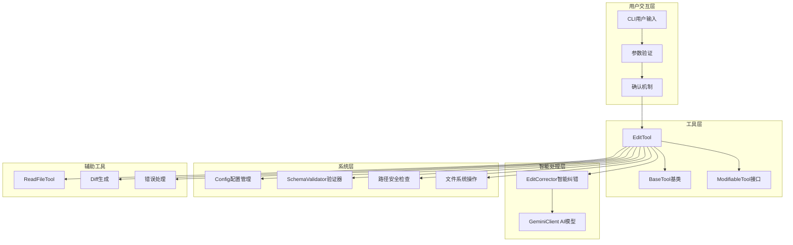
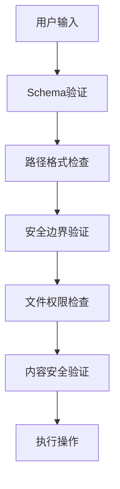

# Gemini CLI EditTool 架构深度解析

## 📖 前言

本文将深入分析Google开源的Gemini
CLI工具中EditTool的完整架构设计，包括其依赖关系、设计模式、安全机制、以及创新的智能编辑纠正系统。通过对源码的详细剖析，我们将了解如何构建一个安全、可靠、智能的文件编辑工具系统。

## 🏗️ 整体架构概览

### 核心组件图



### 类继承关系

```typescript
interface Tool<TParams, TResult>
    ↑
abstract class BaseTool<TParams, TResult>
    ↑
class EditTool extends BaseTool<EditToolParams, ToolResult>
    ↑
implements ModifiableTool<EditToolParams>
```

## 🔧 核心组件详细分析

### 1. BaseTool - 工具系统基础架构

`BaseTool`类建立了整个工具系统的契约和基础架构：

```typescript
export abstract class BaseTool<TParams, TResult extends ToolResult>
    implements Tool<TParams, TResult> {
    // 核心属性
    readonly name: string; // 工具唯一标识
    readonly displayName: string; // 用户友好显示名
    readonly description: string; // 功能描述
    readonly parameterSchema: object; // JSON Schema参数定义
    readonly isOutputMarkdown: boolean; // 输出是否为Markdown格式
    readonly canUpdateOutput: boolean; // 是否支持流式更新

    // 核心方法契约
    abstract execute(params, signal, updateOutput?): Promise<TResult>;
    validateToolParams(params): string | null;
    shouldConfirmExecute(
        params,
        signal,
    ): Promise<ToolCallConfirmationDetails | false>;
    getDescription(params): string;
}
```

**设计亮点**：

- **泛型设计**：通过泛型`<TParams, TResult>`实现类型安全
- **schema驱动**：每个工具都必须定义参数schema，确保API一致性
- **生命周期管理**：定义了验证→确认→执行的完整生命周期
- **可扩展性**：抽象类设计允许子类定制具体行为

### 2. EditTool - 文件编辑核心实现

#### 2.1 参数接口设计

```typescript
export interface EditToolParams {
    file_path: string; // 绝对路径要求
    old_string: string; // 精确匹配的原始文本
    new_string: string; // 替换后的新文本
    expected_replacements?: number; // 期望替换次数（默认1）
}
```

**设计考量**：

- **绝对路径要求**：防止路径遍历攻击，提高安全性
- **精确匹配策略**：要求精确的上下文匹配，避免误替换
- **替换次数控制**：支持多次替换并验证期望结果

#### 2.2 安全机制深度分析

##### 路径安全检查

```typescript
private isWithinRoot(pathToCheck: string): boolean {
  const normalizedPath = path.normalize(pathToCheck);
  const normalizedRoot = this.rootDirectory;
  const rootWithSep = normalizedRoot.endsWith(path.sep) 
    ? normalizedRoot 
    : normalizedRoot + path.sep;
  return (
    normalizedPath === normalizedRoot ||
    normalizedPath.startsWith(rootWithSep)
  );
}
```

**安全特性**：

1. **路径规范化**：使用`path.normalize()`处理`../`等相对路径符号
2. **边界检查**：确保所有操作限制在根目录内
3. **分隔符处理**：正确处理不同平台的路径分隔符

##### 多层参数验证

```typescript
validateToolParams(params: EditToolParams): string | null {
  // 1. Schema验证 - 类型和格式检查
  if (!SchemaValidator.validate(this.schema.parameters, params)) {
    return 'Parameters failed schema validation.';
  }
  
  // 2. 路径格式验证 - 必须是绝对路径
  if (!path.isAbsolute(params.file_path)) {
    return `File path must be absolute: ${params.file_path}`;
  }
  
  // 3. 安全边界验证 - 必须在根目录内
  if (!this.isWithinRoot(params.file_path)) {
    return `File path must be within the root directory`;
  }
  
  return null;
}
```

### 3. 智能编辑纠正系统 - EditCorrector

这是整个系统最创新的部分，使用AI模型智能纠正用户的编辑操作。

#### 3.1 核心纠正流程

```typescript
export async function ensureCorrectEdit(
    currentContent: string,
    originalParams: EditToolParams,
    client: GeminiClient,
    abortSignal: AbortSignal,
): Promise<CorrectedEditResult>;
```

**纠正策略层次**：

1. **直接匹配检查**：首先尝试原始参数
2. **转义字符处理**：处理可能的转义字符问题
3. **AI智能纠正**：使用Gemini模型分析上下文，修正匹配文本
4. **结果验证**：确保纠正后的结果符合期望

#### 3.2 缓存优化设计

```typescript
const editCorrectionCache = new LruCache<string, CorrectedEditResult>(
    MAX_CACHE_SIZE,
);
const fileContentCorrectionCache = new LruCache<string, string>(MAX_CACHE_SIZE);
```

**缓存策略**：

- **LRU缓存**：最近最少使用算法，防止内存无限增长
- **复合键设计**：使用`currentContent + old_string + new_string`作为缓存键
- **结果缓存**：缓存AI纠正结果，避免重复的昂贵AI调用

#### 3.3 AI纠正示例

假设用户想要替换以下代码：

```javascript
// 用户提供的old_string（可能有格式问题）
"function calculateTotal(items) {
return items.reduce((sum, item) => sum + item.price, 0);
}"

// 文件中的实际内容（缩进不同）
"  function calculateTotal(items) {
    return items.reduce((sum, item) => sum + item.price, 0);
  }"
```

**AI纠正过程**：

1. **直接匹配失败**：0个匹配
2. **转义处理失败**：仍然0个匹配
3. **AI分析**：Gemini分析上下文，识别缩进差异
4. **返回纠正结果**：包含正确缩进的匹配文本

### 4. 配置管理系统 - Config

#### 4.1 审批模式设计

```typescript
export enum ApprovalMode {
    DEFAULT = "default", // 每次操作需要确认
    AUTO_EDIT = "autoEdit", // 自动执行编辑操作
    YOLO = "yolo", // 完全自动化模式
}
```

**渐进式自动化**：

- 用户可以选择"总是同意"选项，系统自动切换到AUTO_EDIT模式
- 支持不同工具类型的独立审批策略

#### 4.2 工具注册机制

```typescript
export function createToolRegistry(config: Config): Promise<ToolRegistry> {
    const registry = new ToolRegistry();

    // 核心工具注册
    const registerCoreTool = (ToolClass: any, ...args: unknown[]) => {
        if (!config.getExcludeTools()?.includes(ToolClass.Name)) {
            registry.registerTool(new ToolClass(config, ...args));
        }
    };

    // 注册所有核心工具
    registerCoreTool(LSTool);
    registerCoreTool(ReadFileTool, config.getTargetDir());
    registerCoreTool(EditTool);
    registerCoreTool(ShellTool);
    // ... 更多工具
}
```

### 5. 可修改工具接口 - ModifiableTool

这个接口支持外部编辑器修改工具操作，是一个优秀的扩展性设计：

```typescript
export interface ModifiableTool<ToolParams> extends Tool<ToolParams> {
    getModifyContext(abortSignal: AbortSignal): ModifyContext<ToolParams>;
}

export interface ModifyContext<ToolParams> {
    getFilePath: (params: ToolParams) => string;
    getCurrentContent: (params: ToolParams) => Promise<string>;
    getProposedContent: (params: ToolParams) => Promise<string>;
    createUpdatedParams: (
        oldContent: string,
        modifiedProposedContent: string,
        originalParams: ToolParams,
    ) => ToolParams;
}
```

**工作流程**：

1. **创建临时文件**：当前内容 vs 建议内容
2. **外部编辑器**：用户使用熟悉的编辑器修改
3. **生成新参数**：基于用户修改生成新的工具参数
4. **清理资源**：删除临时文件

## 🛡️ 安全性设计深度分析

### 1. 多层次安全防护



### 2. 路径遍历攻击防护

```typescript
// 攻击示例及防护
const maliciousPath = "/project/src/../../../etc/passwd";
const normalizedPath = path.normalize(maliciousPath);
// 结果: "/etc/passwd"

// 安全检查
if (!normalizedPath.startsWith(this.rootDirectory + path.sep)) {
    throw new Error("Path traversal attack detected!");
}
```

### 3. 文件内容验证

- **编码检查**：确保文件使用UTF-8编码
- **大小限制**：避免处理过大文件导致内存问题
- **权限验证**：检查文件读写权限

## 🔄 错误处理和用户体验

### 1. 分层错误信息

```typescript
interface CalculatedEdit {
    error?: {
        display: string; // 用户友好的错误信息
        raw: string; // 详细的技术错误信息
    };
}
```

**错误信息设计**：

- **用户层**：简洁易懂的错误描述
- **开发者层**：详细的技术错误信息和建议
- **AI层**：适合AI模型理解的结构化错误信息

### 2. 渐进式确认机制

```typescript
async shouldConfirmExecute(): Promise<ToolCallConfirmationDetails | false> {
  // 1. 检查自动模式
  if (this.config.getApprovalMode() === ApprovalMode.AUTO_EDIT) {
    return false;
  }
  
  // 2. 生成预览
  const editData = await this.calculateEdit(params, abortSignal);
  
  // 3. 创建可视化diff
  const fileDiff = Diff.createPatch(fileName, currentContent, newContent);
  
  // 4. 返回确认详情
  return {
    type: 'edit',
    title: `Confirm Edit: ${relativePath}`,
    fileDiff,
    onConfirm: async (outcome) => {
      if (outcome === ToolConfirmationOutcome.ProceedAlways) {
        this.config.setApprovalMode(ApprovalMode.AUTO_EDIT);
      }
    },
  };
}
```

## 🔧 实际使用场景和例子

### 场景1：代码重构 - 函数重命名

```typescript
// 原始文件内容
const currentContent = `
class DataProcessor {
  processUserData(userData) {
    return this.validateData(userData);
  }
  
  validateData(data) {
    return data !== null;
  }
}
`;

// 编辑参数
const params = {
    file_path: "/project/src/DataProcessor.js",
    old_string: `  processUserData(userData) {
    return this.validateData(userData);
  }`,
    new_string: `  processUserInformation(userData) {
    return this.validateData(userData);
  }`,
};

// 执行结果
const result = await editTool.execute(params, abortSignal);
// 成功：函数名从 processUserData 改为 processUserInformation
```

### 场景2：配置文件批量更新

```typescript
const params = {
    file_path: "/project/config/database.js",
    old_string: "localhost",
    new_string: "production.example.com",
    expected_replacements: 3, // 期望替换3处localhost
};

// 系统会验证确实找到3处匹配，然后全部替换
```

### 场景3：AI智能纠错展示

```typescript
// 用户提供的参数（格式有问题）
const userParams = {
    file_path: "/project/src/utils.js",
    old_string: 'function helper(){return"value";}', // 压缩格式
    new_string: 'function helper() { return "new value"; }',
};

// 文件中的实际内容（标准格式化）
const actualContent = `
function helper() {
  return "value";
}
`;

// AI纠正过程：
// 1. 直接匹配失败（0个匹配）
// 2. Gemini分析上下文，识别这是同一个函数
// 3. 返回格式化后的正确匹配文本
// 4. 成功执行替换
```

### 场景4：创建新文件

```typescript
const params = {
    file_path: "/project/src/newModule.js",
    old_string: "", // 空字符串表示创建新文件
    new_string: `export class NewModule {
  constructor() {
    this.initialized = true;
  }
  
  process() {
    return "processed";
  }
}`,
};

// 结果：创建新文件，包含完整的类定义
```

## 🚀 性能优化策略

### 1. 智能缓存机制

```typescript
// 编辑纠正结果缓存
const cacheKey = `${currentContent}---${old_string}---${new_string}`;
if (editCorrectionCache.has(cacheKey)) {
    return editCorrectionCache.get(cacheKey);
}
```

**缓存策略优势**：

- **减少AI调用**：相同的编辑操作复用结果
- **提高响应速度**：缓存命中时几乎零延迟
- **内存控制**：LRU策略防止内存溢出

### 2. 异步操作优化

```typescript
// 并行处理多个验证步骤
const [validationError, editData] = await Promise.all([
    this.validateToolParams(params),
    this.calculateEdit(params, signal),
]);
```

### 3. 文件操作优化

```typescript
// 同步读取小文件，避免异步复杂性
const content = fs.readFileSync(filePath, "utf8");

// 统一换行符，提高处理一致性
const normalizedContent = content.replace(/\r\n/g, "\n");
```

## 📈 可扩展性设计分析

### 1. 插件化工具系统

```typescript
// 工具注册机制支持动态添加工具
const registry = new ToolRegistry();
registry.registerTool(new CustomEditTool());
registry.registerTool(new DatabaseEditTool());
registry.registerTool(new ConfigEditTool());
```

### 2. 配置驱动的行为

```typescript
// 通过配置控制工具行为
if (config.getApprovalMode() === ApprovalMode.YOLO) {
    // 跳过所有确认，直接执行
}

if (config.getDebugMode()) {
    // 输出详细的调试信息
}
```

### 3. 多模态AI支持

```typescript
// 支持不同的AI模型
const client = new GeminiClient(config);
await client.generateJson(contents, schema, signal, "gemini-flash");
await client.generateJson(contents, schema, signal, "gemini-pro");
```

## 🎯 设计模式应用

### 1. 策略模式 - ApprovalMode

```typescript
interface ApprovalStrategy {
    shouldConfirm(params: EditToolParams): boolean;
}

class DefaultApproval implements ApprovalStrategy {
    shouldConfirm() {
        return true;
    }
}

class AutoApproval implements ApprovalStrategy {
    shouldConfirm() {
        return false;
    }
}
```

### 2. 模板方法模式 - BaseTool

```typescript
abstract class BaseTool {
    // 模板方法定义算法骨架
    async executeTool(params: TParams): Promise<TResult> {
        const error = this.validateToolParams(params);
        if (error) return this.handleError(error);

        const shouldConfirm = await this.shouldConfirmExecute(params);
        if (shouldConfirm && !await this.confirmWithUser(shouldConfirm)) {
            return this.handleCancel();
        }

        return this.execute(params); // 子类实现具体逻辑
    }
}
```

### 3. 责任链模式 - 编辑纠正

```typescript
// 纠正策略链
const correctionChain = [
    new DirectMatchCorrector(),
    new UnescapeCorrector(),
    new AICorrector(),
    new FallbackCorrector(),
];

for (const corrector of correctionChain) {
    const result = await corrector.correct(params);
    if (result.success) return result;
}
```

### 4. 观察者模式 - 配置变更

```typescript
config.onApprovalModeChange((newMode) => {
    editTool.updateBehavior(newMode);
});
```

## 🔮 架构优势总结

### 1. 安全性

- **多层防护**：Schema验证、路径检查、权限验证
- **路径遍历防护**：彻底阻止目录遍历攻击
- **内容验证**：确保文件内容安全性

### 2. 可靠性

- **智能纠错**：AI辅助的编辑参数纠正
- **事务性操作**：要么完全成功，要么完全失败
- **详细错误信息**：帮助用户快速定位问题

### 3. 用户体验

- **可视化确认**：Diff显示让用户清楚了解变更
- **渐进式自动化**：从手动确认到自动执行的平滑过渡
- **外部编辑器支持**：ModifiableTool接口支持用户熟悉的编辑器

### 4. 扩展性

- **插件化架构**：工具注册机制支持动态扩展
- **配置驱动**：行为通过配置灵活控制
- **接口隔离**：清晰的接口定义便于扩展

### 5. 性能

- **智能缓存**：避免重复的昂贵AI调用
- **异步优化**：合理使用异步操作提高响应速度
- **资源管理**：LRU缓存和及时清理防止内存泄漏

## 🎓 学习要点和最佳实践

### 1. 工具开发最佳实践

- **安全第一**：始终验证用户输入，防止安全漏洞
- **用户体验**：提供清晰的错误信息和操作预览
- **可扩展性**：使用接口和抽象类设计可扩展的架构
- **性能考虑**：合理使用缓存和异步操作

### 2. AI集成模式

- **智能辅助**：AI作为辅助工具，而非替代人类判断
- **缓存策略**：AI调用成本高，必须有效缓存结果
- **失败处理**：AI可能失败，需要优雅的降级策略

### 3. 企业级工具设计

- **配置管理**：支持不同环境和用户偏好的配置
- **审计日志**：记录所有操作用于问题追踪
- **权限控制**：细粒度的权限管理机制

## 🏁 结语

Gemini
CLI的EditTool展示了现代工具开发的诸多最佳实践：安全的架构设计、智能的AI集成、优秀的用户体验、以及高度的可扩展性。通过深入分析这个系统，我们可以学习到如何构建既强大又安全的开发工具。

这个架构的创新点在于将AI智能纠错无缝集成到传统的文件编辑工作流中，既保持了操作的精确性，又大大提高了用户体验。对于希望开发类似工具的开发者来说，这是一个值得深入研究和借鉴的优秀案例。

---

_本文基于Gemini CLI源码分析编写，旨在分享优秀的架构设计和实现思路。_
